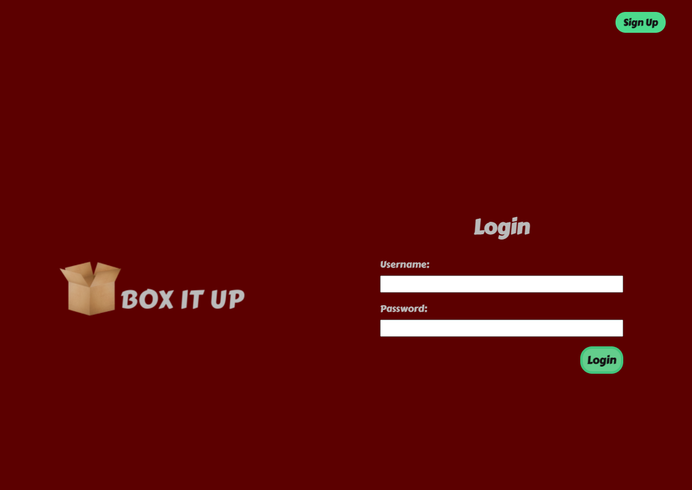
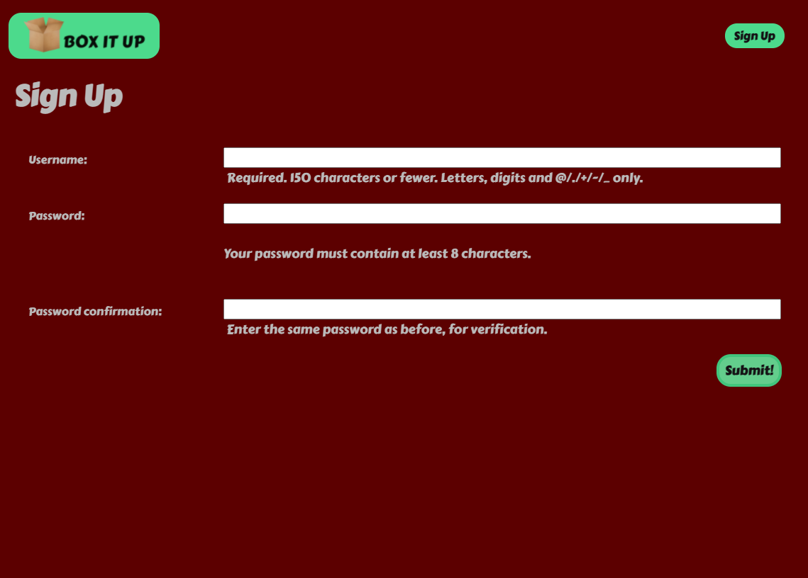
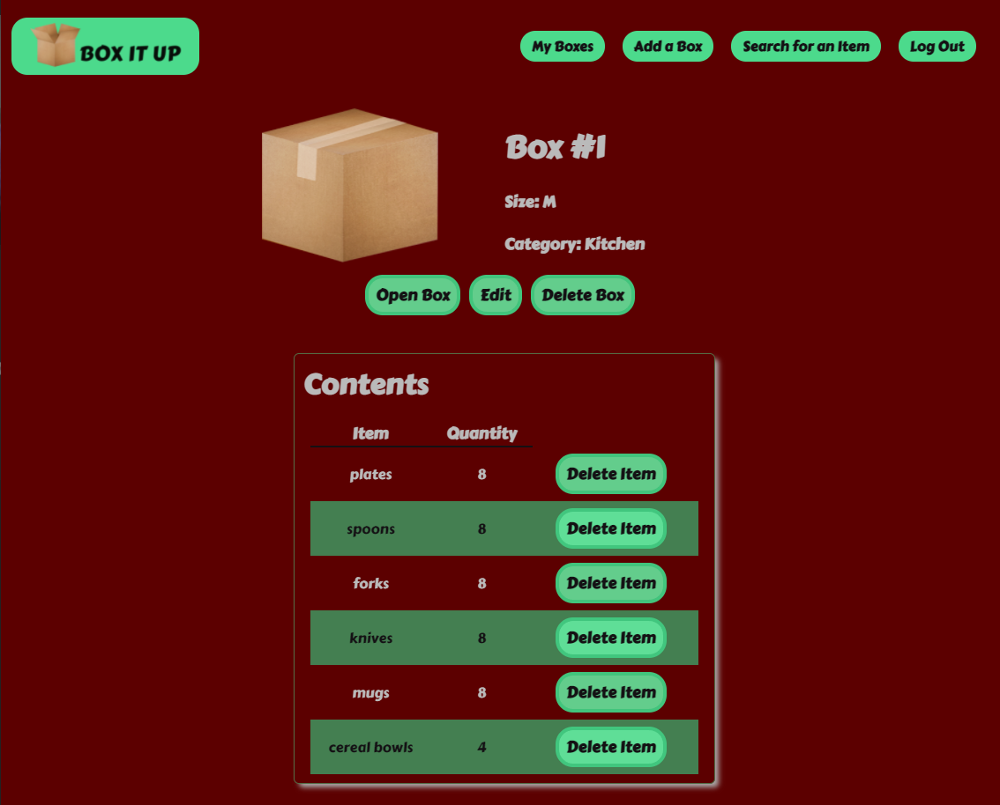
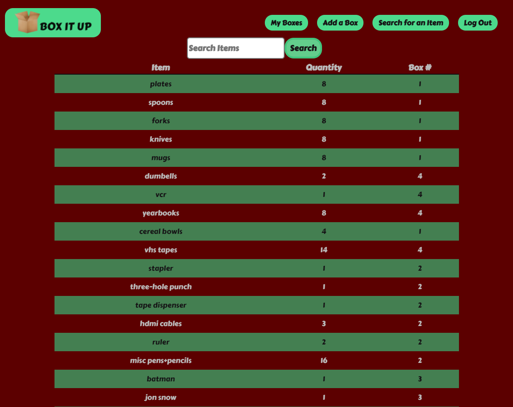

# Box It Up

Have you ever packed your stuff up in boxes, but then you can't remeber what you have in each box or in which box that box cutter is? Well now there's Box It Up, a new app that lets you create boxes, fill them up, and close them so they don't change. Each box has a number, size, and category (i.e. room), and each box can have items added to it. Once the box is full and ready to be taped up, simply hit the 'close box' button, and you won't be able to add any more items to it. Perfect for the frequent mover in your life!
***

## [Deployed Link](https://boxitup-rhk.herokuapp.com/) 
***
## [Trello Board](https://trello.com/b/WeFdlvHi/unit-3-project)
***
## Screenshots
 
 
 
 
 
 
 
 

***
## Technologies Used
  - Python
  - Django
  - HTML
  - CSS
  - JavaScript
  - Google Fonts
***
# Next Steps - Icebox
  - Bins to group boxes
  - Dark Mode
